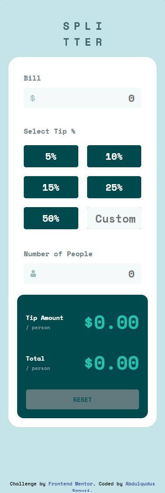

# Frontend Mentor - Tip calculator app solution

This is a solution to the [Tip calculator app challenge on Frontend Mentor](https://www.frontendmentor.io/challenges/tip-calculator-app-ugJNGbJUX). Frontend Mentor challenges help you improve your coding skills by building realistic projects.

## Table of contents

- [Overview](#overview)
  - [The challenge](#the-challenge)
  - [Screenshot](#screenshot)
  - [Links](#links)
- [My process](#my-process)
  - [Built with](#built-with)
  - [What I learned](#what-i-learned)
  - [Continued development](#continued-development)
  - [Useful resources](#useful-resources)
- [Author](#author)

**Note: Delete this note and update the table of contents based on what sections you keep.**

## Overview

### The challenge

Users should be able to:

- View the optimal layout for the app depending on their device's screen size
- See hover states for all interactive elements on the page
- Calculate the correct tip and total cost of the bill per person

### Screenshot




### Links

- Solution URL: [Add solution URL here](https://www.frontendmentor.io/solutions/responsive-tip-calculator-html-css-and-vanilla-javascript-7Ltdl0PjXt)
- Live Site URL: [Add live site URL here](https://tip-calculator-24.netlify.app/)

## My process

### Built with

- Semantic HTML5 markup
- CSS custom properties
- Flexbox
- CSS Grid
- Desktop-first workflow
- Vanilla JavaScript


### What I learned

```js
function converter(input){
    if(input.value == ''){
        return input.value = '';
    }else{
         console.log(parseFloat(input.value));
    return parseFloat(input.value);
    }
   
}
```

### Continued development

In future projects, i would love to focus on writing cleaner codes, layouts, using the DRY principle.
 
### Useful resources

- [geekforgeeks](https://www.geeksforgeeks.org/javascript-tofixed-function/#:~:text=The%20toFixed()%20method%20in,the%20right%20of%20the%20decimal.&text=The%20toFixed()%20method%20is,'%20operator.) - This helped me to understand the the toFixed() method.
- [w3schools](https://www.w3schools.com/) - This amazing website served as quick reference for some HTML, CSS and JavaScript concepts.

## Author

- Frontend Mentor - [@qudus2019](https://www.frontendmentor.io/profile/qudus2019)
- Twitter - [@_iamqudus](https://www.twitter.com/_iamqudus)

